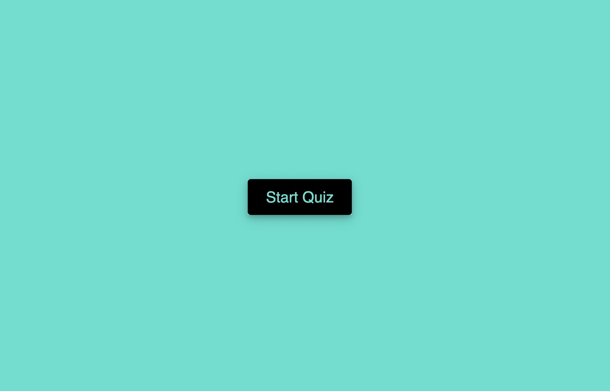
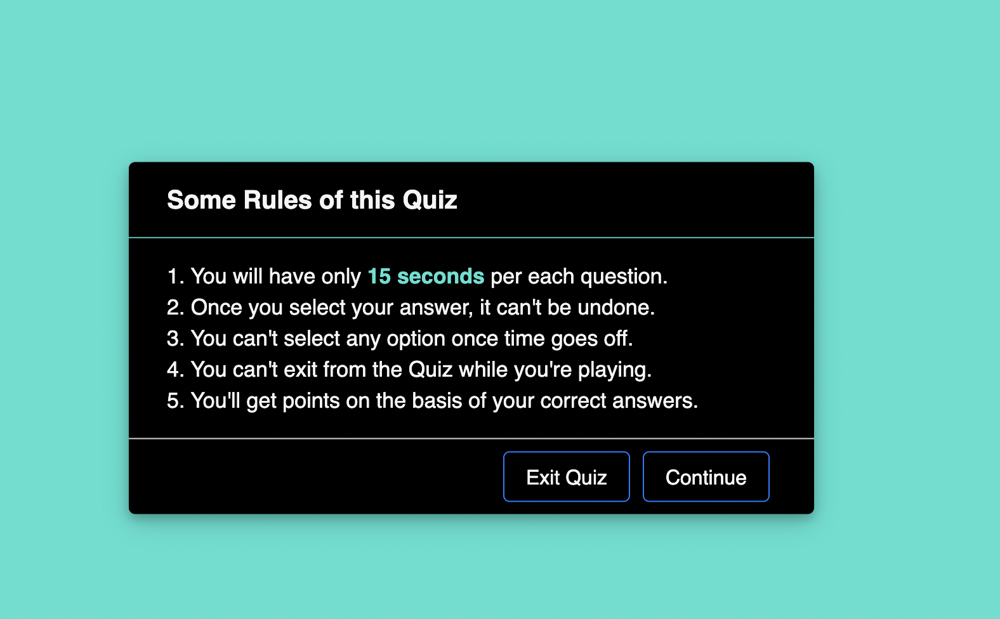
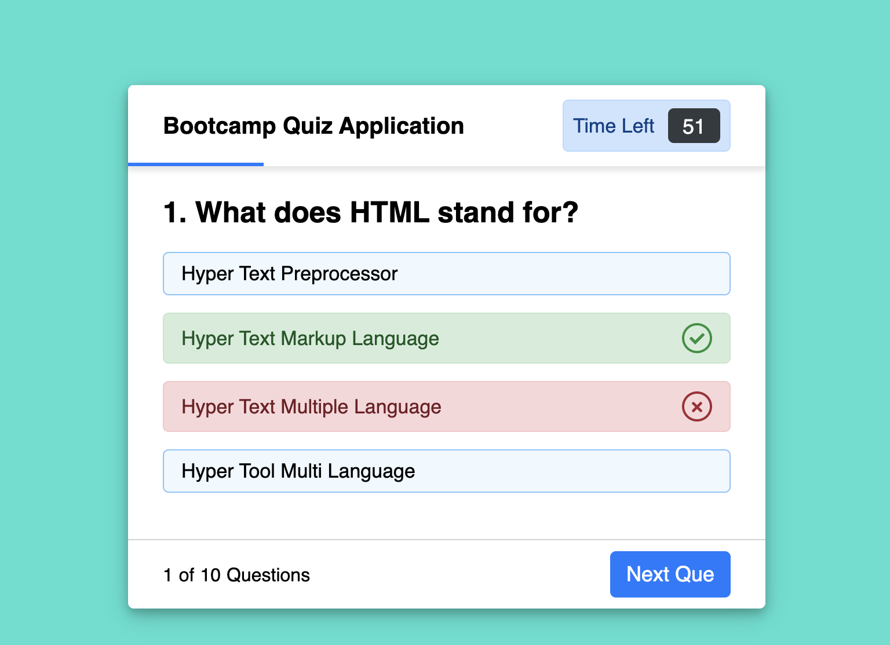

# Okay_Quiz_App

I started off by trying to set some rules to my quiz app before selecting if they wanted to continue or quiz.
Upon clicking continue the user would go ahead and proceed to taking and playing the quiz game.

In the HTML i included the rules and some btns and divs to be later injected from javascript.

I created 2 seperate js files one for the questions and some for the actual code itself.

after which i created the code to add eventlisenters to the buttons to do things such as moving to the next question.

Added icons for the correct and incorrect answers having an issue because i cant find my API key anymore for font awesome.

Then attached the questions into a string to be able to pull the correct answer 

Link to the deployed site
https://jzamorano20.github.io/Okay_Quiz_App/